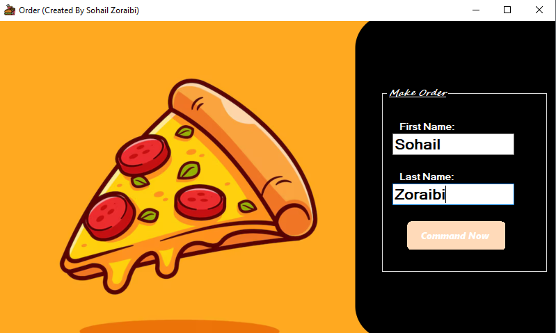
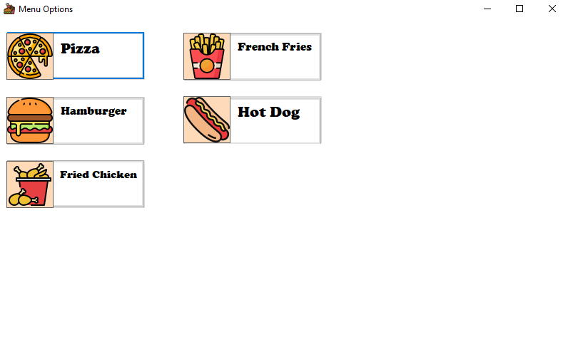
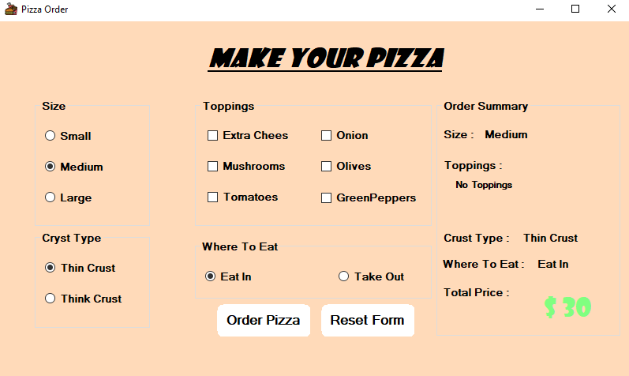

# 🍔 Fast Food Ordering System (WinForms App)

A beginner-friendly C# Windows Forms application that simulates a fast-food restaurant ordering system. Users can enter their names, choose from menu options (currently pizza), select toppings, crust type, and eat-in/take-out preferences.

---

## 🖼️ Screenshots

### 🏠 Main Order Screen


### 🧀 Menue Options


### 🍕 Pizza Customization Screen


### 🧾 Order Summary Card


---

## 📦 Features

- 🔒 Name input validation
- 🍕 Pizza size & crust selection
- 🧀 Multiple toppings support with dynamic price calculation
- 📊 Real-time price updates
- 🧾 Summary card preview before confirming order
- 🧼 Reset form functionality
- 💅 Custom rounded button styling

---

## 🛠️ Technologies Used

- C# (.NET Framework)
- Windows Forms (WinForms)
- Visual Studio Community

---

## 🚀 Getting Started

### Prerequisites:
- Visual Studio (Community Edition is fine)
- .NET Framework (typically 4.7.2 or compatible)

### Steps:
1. Clone this repository:
   ```bash
   git clone https://github.com/your-username/FastFoodProject.git
